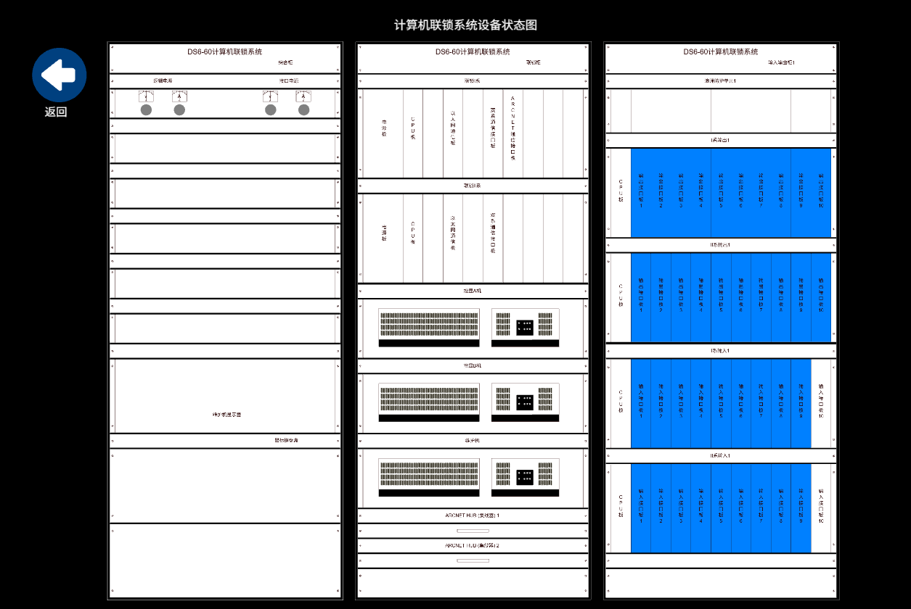

# Convert DXF to PIXI using Vue Framework

[中文](#中文说明) | [English](#english-readme)

---

## English README

### Introduction

A web-based DXF file viewer built with Vue 3 and PixiJS. This project parses DXF (Drawing Exchange Format) files and renders them as interactive 2D graphics in the browser.

### Preview



### Tech Stack

- **Frontend Framework**: Vue 3 (Composition API)
- **Rendering Engine**: PixiJS 8.x
- **Build Tool**: Vite 6.x
- **Styling**: SCSS

### Features

- Parse and render DXF files (2018 format)
- Interactive canvas with zoom and pan support
- Click event handling for DXF entities
- Black background for better visibility

### Prerequisites

- Node.js >= 18.x
- npm >= 10.x

### Installation

```bash
git clone <repository-url>
cd Convert-DXF-to-PIXI-using-the-Vue-framework
npm install
```

### Usage

```bash
npm run dev
```

The browser will open automatically. Place your DXF file as `public/temp.dxf` to view it.

### Project Structure

```
├── public/
│   └── temp.dxf              # Sample DXF file
├── src/
│   ├── components/
│   │   └── DSComp.vue        # Main rendering component
│   ├── js/
│   │   ├── CAD_COLORS.js     # CAD color palette
│   │   ├── calcTools.js      # Calculation utilities
│   │   ├── PixiGraphicsTool.js # PixiJS graphics helpers
│   │   └── StaticSD.js       # Static drawing manager
│   ├── utils/
│   │   └── dxf/              # DXF parser module
│   │       ├── index.js
│   │       ├── parseString.js
│   │       ├── handlers/     # Entity handlers
│   │       └── util/         # Parser utilities
│   ├── App.vue
│   └── main.js
├── package.json
└── vite.config.js
```

### Limitations

- DXF file should be in **2018 format**
- Recommended file size: length should not exceed **5000 pixels**

### License

MIT

---

## 中文说明

### 介绍

一个基于 Vue 3 和 PixiJS 构建的网页端 DXF 文件查看器。本项目可以解析 DXF（图形交换格式）文件，并在浏览器中以交互式 2D 图形的方式渲染显示。

### 预览


### 技术栈

- **前端框架**：Vue 3（组合式 API）
- **渲染引擎**：PixiJS 8.x
- **构建工具**：Vite 6.x
- **样式**：SCSS

### 功能特性

- 解析并渲染 DXF 文件（2018 格式）
- 支持画布缩放和平移的交互操作
- 支持 DXF 实体的点击事件处理
- 黑色背景，提高图形可见性

### 环境要求

- Node.js >= 18.x
- npm >= 10.x

### 安装

```bash
git clone <repository-url>
cd Convert-DXF-to-PIXI-using-the-Vue-framework
npm install
```

### 使用方法

```bash
npm run dev
```

浏览器会自动打开。将你的 DXF 文件命名为 `temp.dxf` 放入 `public` 目录即可查看。

### 项目结构

```
├── public/
│   └── temp.dxf              # 示例 DXF 文件
├── src/
│   ├── components/
│   │   └── DSComp.vue        # 主渲染组件
│   ├── js/
│   │   ├── CAD_COLORS.js     # CAD 颜色配置
│   │   ├── calcTools.js      # 计算工具函数
│   │   ├── PixiGraphicsTool.js # PixiJS 图形工具
│   │   └── StaticSD.js       # 静态图纸管理器
│   ├── utils/
│   │   └── dxf/              # DXF 解析模块
│   │       ├── index.js
│   │       ├── parseString.js
│   │       ├── handlers/     # 实体处理器
│   │       └── util/         # 解析工具函数
│   ├── App.vue
│   └── main.js
├── package.json
└── vite.config.js
```

### 限制说明

- DXF 文件应为 **2018 版本格式**
- 建议文件尺寸：长度不超过 **5000 像素**

### 许可证

MIT
